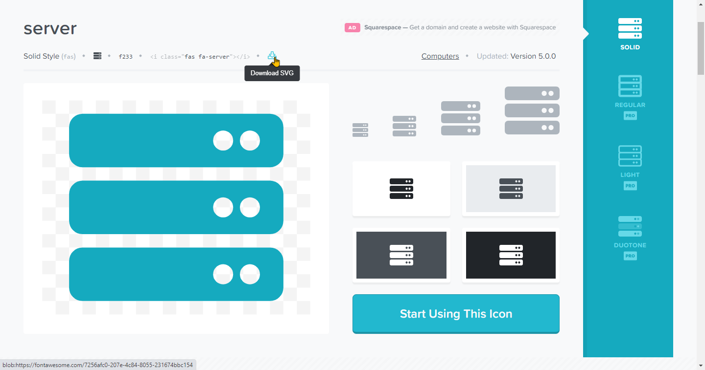
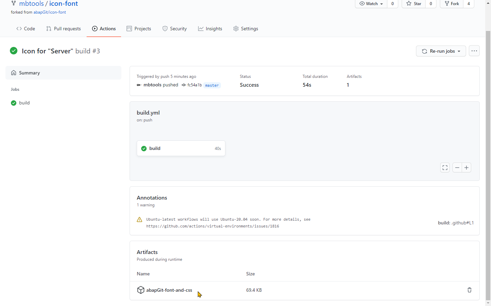

[](https://github.com/abapGit/icon-font/actions/workflows/build.yml)

# abapGit webfont generator package

Icons in abapGit are displayed using a specially build font. As a default, abapGit uses icons from the free distribution of [Font Awesome](https://fontawesome.com/). When adding other icons mind the license matters please. Glyphs must be licensed for free usage (MIT, CC, SIL OFL).

Note: The font is not limited to icons. For example, it include the abapGit logo (Git icon + abapGit text).

See also the current font content at https://icons.abapgit.org.

## Build

### GitHub Action

On every commit and pull request, a GitHub action will build the abapGit icon font and corresponding CSS files. The files are available as an artifact in the action and you can download them from there.

When a pull request with new icons is merged (or on push to main branch) the content is also published to [https://github.com/abapGit/icon-font](https://github.com/abapGit/icons.abapgit.org). The result can be also seen at https://icons.abapgit.org. As well, the compiled version of the font and css are available to download from that page.

### Nodejs Build

Alternatively, you can build using nodejs (version 10 at the time of package creation):

```
npm install
npm run build
```

This will create build folder with font, css file and html to review icons. Upload woff and css to abapGit (see docs).

## Adding Icons

Here are the steps to add icons to this repository:

1. Search [Font Awesome - Free & Solid](https://fontawesome.com/search?o=r&m=free&s=solid) library for icons (preferred to match existing icons)
1. Get the SVG files for the icons you want to add
- [Download](https://fontawesome.com/download) Font Awesome free distribution and get the SVG files from there or
- Find the icons on and download the SVG files from the [Font Awesome website](https://fontawesome.com/icons?d=gallery&m=free)

2. Copy additional icons to `/svg/` folder of your fork (or submit own glyphs ;)
3. Commit to your fork and create a pull request
4. Download the abapGit icon font and CSS files from the GitHub action


The steps to update abapGit are documented [here](https://docs.abapgit.org/development/adding-icons.html).


## Credits

abapGit icons are created from [Font Awesome](https://fontawesome.com/) free icon set ([CC BY 4.0 License](https://fontawesome.com/license/free)).
